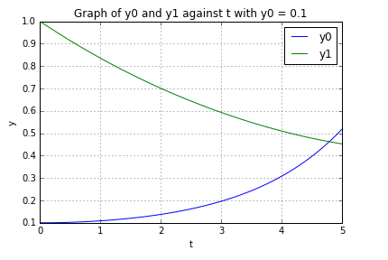

UECM3033 Assignment #3 Report
========================================================

- Prepared by: Liew Kok Hoong
- Tutorial Group: T3

--------------------------------------------------------

## Task 1 --  Gauss-Legendre formula

The reports, codes and supporting documents are to be uploaded to Github at: 

[https://github.com/1203222/UECM3033_assign3]

Explain how you implement your `task1.py` here.

Firstly, I will create gausslegendre() function in order to put the codes for the values of the weights and nodes in Gauss-Legendre quadrature and Gauss-Legendre quadrature formula. Due to the interval of Gauss-Legendre quadrature is from -1 to 1, I will put one more formula which is ((b-a)*N+b+a) * 0.5 to transform the interval of the definite integral from [0,1] to [-1,1] in gausslegendre() function. In the main Python code body of task1.py, there consists of two functions which are f(x) and my_integral(). These two functions are to calculate the exact solution of the integral and the solution that implement the Gauss-Legendre quadrature. Finally, run task1.py to get Answer : I = -139/6 + 34 * log(2) and Your implementation gives: I =  0.400338097411 with the number of sample points used in the Gauss-Legendre quadrature is 20.  

Explain how you get the weights and nodes used in the Gauss-Legendre quadrature.

I apply numpy.polynomial.legendre.leggauss(n) with n is the number of sample points used in the Gauss-Legendre quadrature to get the weights and nodes used in the Gauss-Legendre quadrature. For example, if n is set to 2, the values of the weights and nodes in Gauss-Legendre quadrature after applied numpy.polynomial.legendre.leggauss(2) are [ 1.,  1.] and [-0.57735027,  0.57735027].

---------------------------------------------------------

## Task 2 -- Predator-prey model

Explain how you implement your `task2.py` here, especially how to use `odeint`.

Put your graphs here and explain.

Is the system of ODE sensitive to initial condition? Explain.

-----------------------------------

last modified: change your date here
