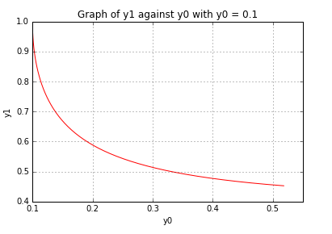
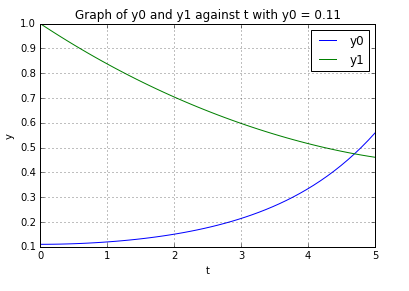
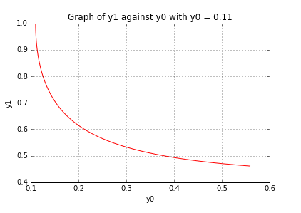

UECM3033 Assignment #3 Report
========================================================

- Prepared by: Liew Kok Hoong
- Tutorial Group: T3

--------------------------------------------------------

## Task 1 --  Gauss-Legendre formula

The reports, codes and supporting documents are to be uploaded to Github at: 

[https://github.com/1203222/UECM3033_assign3]

Explain how you implement your `task1.py` here.

Firstly, I will create gausslegendre() function in order to put the codes for the values of the weights and nodes in Gauss-Legendre quadrature and Gauss-Legendre quadrature formula. Due to the interval of Gauss-Legendre quadrature is from -1 to 1, I will put one more formula which is ((b-a)*N+b+a) * 0.5 to transform the interval of the definite integral from [0,1] to [-1,1] in gausslegendre() function. In the main Python code body of task1.py, there consists of two functions which are f(x) and my_integral(). These two functions are to calculate the exact solution of the integral and the solution that implement the Gauss-Legendre quadrature. Finally, run task1.py to get Answer : I = -139/6 + 34 * log(2) and Your implementation gives: I =  0.400338097411 with the number of sample points used in the Gauss-Legendre quadrature is 20.  

Explain how you get the weights and nodes used in the Gauss-Legendre quadrature.

I apply numpy.polynomial.legendre.leggauss(n) with n is the number of sample points used in the Gauss-Legendre quadrature to get the weights and nodes used in the Gauss-Legendre quadrature. For example, if n is set to 2, the values of the weights and nodes in Gauss-Legendre quadrature after applied numpy.polynomial.legendre.leggauss(2) are [ 1.,  1.] and [-0.57735027,  0.57735027].

---------------------------------------------------------

## Task 2 -- Predator-prey model

Explain how you implement your `task2.py` here, especially how to use `odeint`.

Firstly, I will create ode() function with inputs of y, t and constants a and b. After that, I will put differential equations to calculate the derivatives of y0 and y1. In the main Python code body of task2.py, the values of constants a and b are 1.0/year and 0.2/year. I will generate a solution with 50 evenly spaced samples from t = 0 to 5 years. Next, scipy.integrate.odeint is applied to solve the system of ODEs. The parameters of scipy.integrate.odeint are ode() function, initial condition of y0 and y1 which are 0.1 and 1.0, t = 0 to 5 years, and arguments of constants a and b. The solution will be displayed by plotting the graphs of y0 and y1 against t and graph of y1 against y0.

To test the system of ODE sensitive on initial conditions, the initial condition of y0 is changed from 0.1 to 0.11. The system of ODEs is solved by using scipy.integrate.odeint and the solution is displayed by plotting the graphs of y0 and y1 against t and graph of y1 against y0.

Put your graphs here and explain.

The graph of y0 and y1 against t with initial conditions of y0 and y1 are 0.1 and 1.0. The graph shows that y0 is increasing and y1 is decreasing when t is increasing.

The graph of y1 against y0 with initial conditions of y0 and y1 are 0.1 and 1.0. The graph shows that y1 is decreasing when y0 is increasing.

The graph of y0 and y1 against t with initial conditions of y0 and y1 are 0.11 and 1.0. The graph shows that y0 is increasing and y1 is decreasing when t is increasing.

The graph of y1 against y0 with initial conditions of y0 and y1 are 0.11 and 1.0. The graph shows that y1 is decreasing when y0 is increasing.

Is the system of ODE sensitive to initial condition? Explain.

The system of ODE is not sensitive to initial condition. Based on the 4 graphs aboved, there are no much difference between the graph of y0 and y1 against t with initial condition of y0 is 0.1 and 0.11. This situation holds for the graph of y1 against y0 with initial conditions of y0 is 0.1 and 0.11.

-----------------------------------

last modified: 18/4/2016
